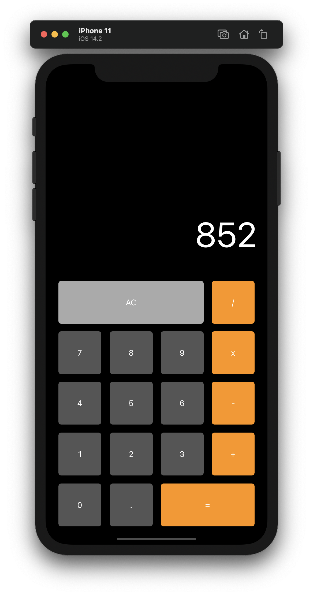

# Description
A minimal app to do 4 function calculations.  The calculator will store the last value in memory to be used in the next function.

# Execution
You will need to run the program with Xcode\
`cmd + r` to run

# Useful Sites

https://swift.org/documentation/
https://medium.com/@chris.mash/the-anatomy-of-an-ios-storyboard-d473a4076b25
